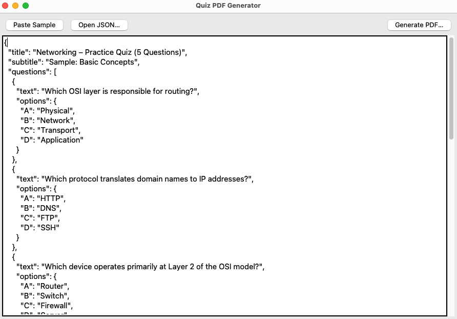

# llm-quiz-generator
Generate a Quiz Using LLM

## How to use it
1. Use [Quiz Generator Prompt](./quiz-generator-prompt.md) to generate a quiz json file (You can use any LLM like ChatGPT, Gemini etc.).
2. Run the [Quiz Generator App](./quiz_generator_gui.py) to generate pdf using quiz json file.
3. Export the pdf file. 

## How to run the Quiz Generator App
### 1. Install Dependencies
```sh
pip install reportlab tkinter
```
### 2. Run The App
```sh
python ./quiz_generator_gui.py
```

## Screenshot
